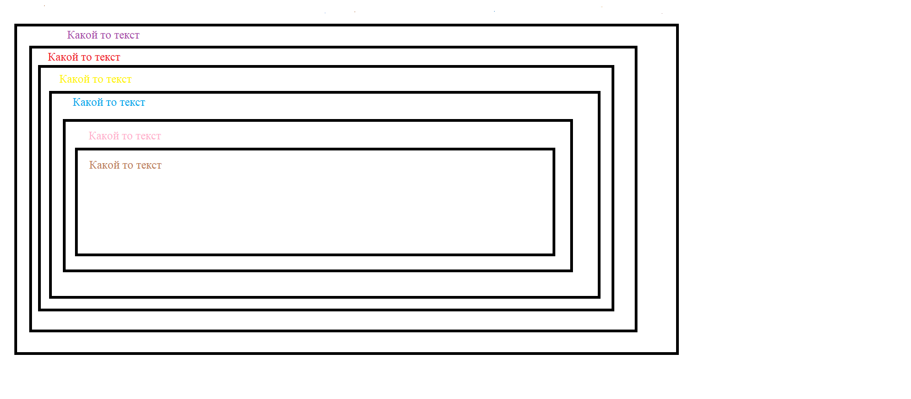

# Домашняя работа

## Читаем литературу:

1. Читаем материал лекци;

2. Читаем и выполняем задания:
 * https://webref.ru/course/css-basics/why-css-exists;
 * https://webref.ru/course/css-basics/syntax#content;
 * https://webref.ru/course/css-basics/selectors -- псевдоклассы пропускаем;
 * https://webref.ru/course/css-basics/size -- повторяем проценты, пиксели все остальное пропускаем.
3. Практика:
  3.1 Используя внешний файл сss создать 2 класса accent и error. Accent - задает золотой цвет тексту, 
      увеличивает размер шрифта и дает жирное начертание. Класс Error - делает все тоже только красного цвета
      Применить каждый класс к отдельному параграфу с текстом.  
  3.2 Cоздать 6 вложенные друг в друга тега div. Каждые тег div должен содержать какой то текст.
       1-3тим тегам div даем классы (название на ваше усмотрение), 3-6 тегу div не даем классов.
      Изменить каждому div-у ширину\высоту (размерность на ваше усмотрение) и цвет текста. 
      Схематично рассположени єлементов друг в друге:
 
     